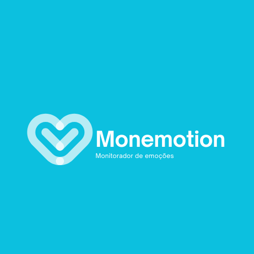
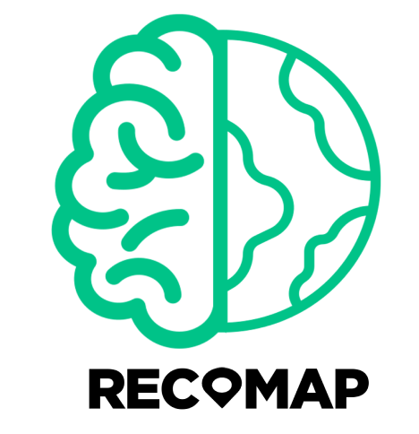

# 🌐 Portfólio de Protótipos

Este repositório reúne links para protótipos desenvolvidos no **Figma**, com foco em projetos acadêmicos e de design de interfaces.

---

## 📌 Projetos

### 1. 🧠 Monemotion — Monitorador de Emoções
  
- **Descrição:** Protótipo de um site para monitoramento e registro de emoções ao longo do tempo.  
- **Origem:** Desenvolvido como parte do Trabalho de Conclusão de Curso (TCC) no IFRN.  
- **Ferramenta:** Figma  
- **Link:** [Acessar protótipo no Figma](https://www.figma.com/design/KVkAob5VtN7GYxU5bwqZ4x/Monemotions?node-id=0-1&p=f&t=hyRR5Kwn3zID7DG0-0)

---

### 2. 🗺️ RecOMap — O Mapa para o Seu Desempenho Acadêmico
  
- **Descrição:** Protótipo de um aplicativo voltado para acompanhar e mapear o desempenho acadêmico de estudantes.  
- **Ferramenta:** Figma  
- **Link:** [Acessar protótipo no Figma](https://www.figma.com/design/j5JIIjAJ3yDtEG43cDjm6Q/RecOMap?node-id=0-1&p=f&t=NqTikGNTQbbTrMWn-0)

---

## 📂 Sobre este repositório
Este espaço serve como vitrine de protótipos interativos, permitindo acesso rápido e organizado aos projetos.  
